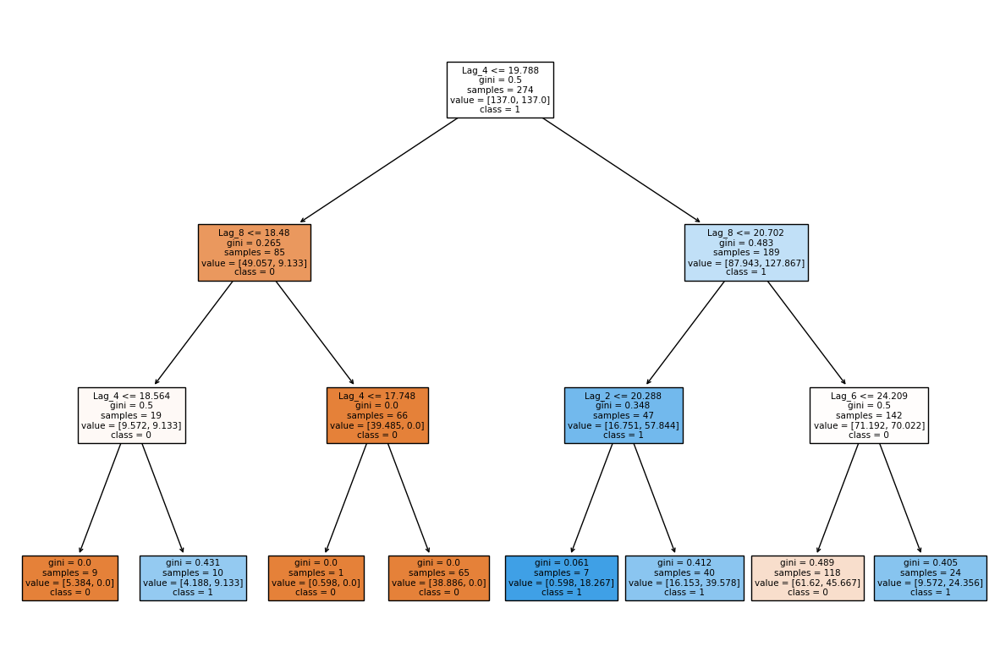

# Predicting Octopus Egg-Laying Events Using Water Temperature


## Project Overview

This project explores the relationship between water temperature and the reproductive cycles of octopuses in a controlled lab environment. The primary goal is to develop an interpretable machine learning model that can predict the likelihood of an octopus laying eggs based on historical temperature data.

This analysis serves as a preliminary investigation to identify potential temperature patterns that could inform future biological experiments. The final model, a **Decision Tree**, suggests a specific signal—a rise in temperature approximately 1.5 months prior to an event—that correlates with egg-laying.

## Key Findings

-   **Temperature Signal:** The model's most significant predictive path indicates that a rise in temperature from below **20.7°C** (8 weeks prior) to above **24.2°C** (6 weeks prior) is a strong indicator of an upcoming egg-laying week.
-   **Model Performance:** The model achieves a **Balanced Accuracy Score of ~56%** on the hold-out test set. While modest, the visual correlation between predictions and actual events is informative, successfully identifying key egg-laying periods:
![Train-test][output2.png]  
-   **Interpretability:** By using a simple Decision Tree with a limited depth (`max_depth=3`), the model's logic is fully transparent, making it a useful tool for generating hypotheses for biologists.

## Project Structure

```
├── data/                  # Raw data files
├── notebooks/             # analysis.ipynb (original exploratory notebook)
├── src/                   # Source code for the project
│   ├── data_processing.py # Script for data cleaning and feature engineering
│   ├── modeling.py        # Script for model training and visualization
│   └── main.py            # Main script to run the pipeline
├── .gitignore             # Files to ignore in Git
├── README.md              # Project documentation
└── requirements.txt       # Python dependencies
```

## Methodology

### 1. Data Processing & Feature Engineering

-   The raw hourly temperature data and daily egg-laying logs were loaded and merged.
-   To manage the severe class imbalance (only 125 laying days out of ~4000), the data was **resampled to a weekly frequency**. The weekly temperature was averaged, and a week was marked as an "event week" if at least one laying occurred.
-   **Lag Features** were created for the temperature data, representing the average temperature from 2, 4, 6, and 8 weeks prior. These features allow the model to make predictions based on past conditions, not current ones.

### 2. Modeling

-   A **Decision Tree Classifier** was chosen for its high interpretability.
-   To account for the remaining class imbalance, the `class_weight='balanced'` parameter was used.
-   The data was split into training and test sets using a time-based split to preserve the temporal order.
-   The model was trained on the first half of the data and evaluated on the second half.

### 3. Interpretation

The trained Decision Tree was visualized to understand the rules it learned for predicting an egg-laying event. The primary signal identified provides a clear, testable hypothesis for marine biologists.



## How to Run This Project

1.  **Clone the repository:**
    ```bash
    git clone https://github.com/your-username/octopus-reproduction-prediction.git
    cd octopus-reproduction-prediction
    ```

2.  **Create a virtual environment and install dependencies:**
    ```bash
    python -m venv venv
    source venv/bin/activate  # On Windows, use `venv\Scripts\activate`
    pip install -r requirements.txt
    ```

3.  **Run the main analysis script:**
    ```bash
    python src/main.py
    ```
    This will process the data, train the model, print the evaluation metrics, and display the prediction and decision tree plots.
